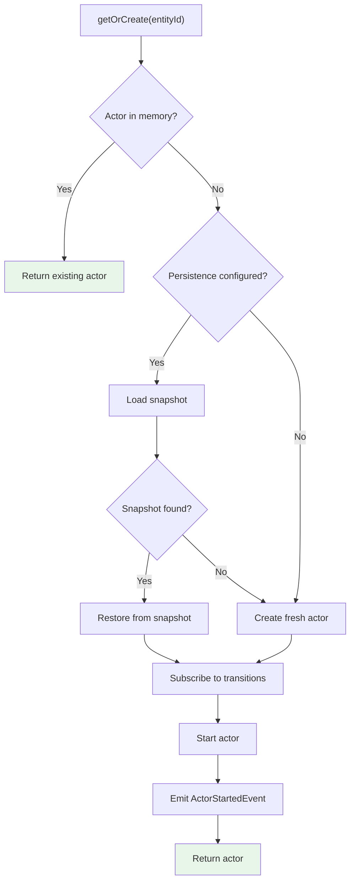
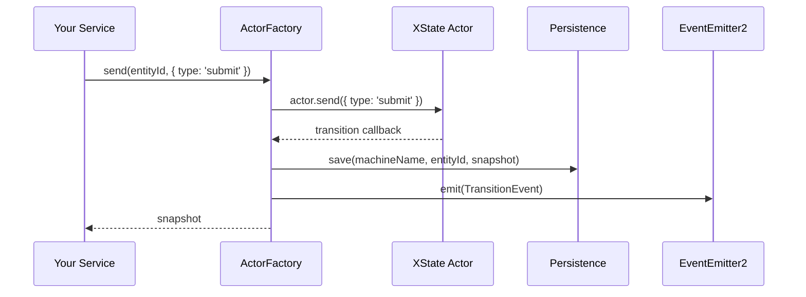

# @opkod-france/nestjs-xstate

[](https://github.com/opkod-france/nestjs-xstate/actions/workflows/ci.yml)
[](https://github.com/opkod-france/nestjs-xstate/actions/workflows/release.yml)
[](https://github.com/semantic-release/semantic-release)
[](https://nestjs.com)
[](https://stately.ai/docs/xstate)
[](https://opensource.org/licenses/MIT)

NestJS workflow engine integrating XState v5 — machine registration, actor lifecycle management, persistence abstraction, and event bridging.

## Table of contents

- [Architecture](#architecture)
- [Installation](#installation)
- [Quick start](#quick-start)
- [DI-powered implementations](#di-powered-implementations)
- [Persistence](#persistence)
- [Events](#events)
- [Async configuration](#async-configuration)
- [API reference](#api-reference)
- [License](#license)

## Architecture

```mermaid
graph TB
    subgraph AppModule
        Root["XStateModule.forRoot()"]
        Root --> Registry["MachineRegistryService"]
        Root --> Persistence["StateMachinePersistence?"]
        Root --> Emitter["EventEmitter2?"]
    end

    subgraph "Feature Module"
        Feature["XStateModule.forFeature()"]
        Feature --> Machine["Machine Definition"]
        Feature --> Factory["ActorFactory"]
    end

    Factory --> Registry
    Factory --> Persistence
    Factory --> Emitter
    Factory --> Actors["Actor instances (Map)"]

    Consumer["Your Service"] -->|@InjectActorFactory| Factory
```

### Actor lifecycle



### Event and persistence flow



## Installation

```bash
npm install @opkod-france/nestjs-xstate xstate
```

### Peer dependencies

| Package | Required |
|---------|----------|
| `@nestjs/common` | `^10 \|\| ^11` |
| `@nestjs/core` | `^10 \|\| ^11` |
| `rxjs` | `^7` |
| `xstate` | `^5` |
| `@nestjs/event-emitter` | Optional — enables lifecycle and transition events |

## Quick start

### 1. Register the module

```ts
import { XStateModule } from '@opkod-france/nestjs-xstate';

@Module({
  imports: [XStateModule.forRoot({})],
})
export class AppModule {}
```

`forRoot` is **global** — `MachineRegistryService`, persistence, and event emitter are available everywhere.

### 2. Register machines per feature

```ts
import { XStateModule } from '@opkod-france/nestjs-xstate';
import { orderMachine } from './order.machine';

@Module({
  imports: [
    XStateModule.forFeature([
      { name: 'order', machine: orderMachine },
    ]),
  ],
})
export class OrderModule {}
```

### 3. Inject and use

```ts
import { InjectActorFactory, ActorFactory } from '@opkod-france/nestjs-xstate';

@Injectable()
export class OrderService {
  constructor(
    @InjectActorFactory('order') private readonly orders: ActorFactory,
  ) {}

  async create(orderId: string, total: number) {
    return this.orders.getOrCreate(orderId, {
      input: { orderId, total },
    });
  }

  async submit(orderId: string) {
    return this.orders.send(orderId, { type: 'submit' });
  }

  async status(orderId: string) {
    return this.orders.getSnapshot(orderId);
  }

  async cancel(orderId: string) {
    return this.orders.stop(orderId, { deletePersisted: true });
  }
}
```

## DI-powered implementations

Inject NestJS services into XState machine implementations (actors, guards, actions):

```ts
XStateModule.forFeature({
  machines: [
    {
      name: 'order',
      machine: orderMachine,
      implementations: (paymentService: PaymentService) => ({
        actors: {
          charge: fromPromise(({ input }) =>
            paymentService.charge(input.id, input.amount),
          ),
        },
      }),
      implementationDeps: [PaymentService],
    },
  ],
  imports: [PaymentModule],
})
```

The `implementations` factory receives resolved NestJS providers in the same order as `implementationDeps`. The result is passed to `machine.provide()`.

## Persistence

Implement the `StateMachinePersistence` abstract class to persist actor snapshots:

```ts
import { Injectable } from '@nestjs/common';
import { StateMachinePersistence } from '@opkod-france/nestjs-xstate';
import type { Snapshot } from 'xstate';

@Injectable()
export class DatabasePersistence extends StateMachinePersistence {
  constructor(private readonly db: DatabaseService) {
    super();
  }

  async save(machineName: string, entityId: string, snapshot: Snapshot<unknown>) {
    await this.db.query(
      `INSERT INTO state_machines (machine, entity_id, snapshot)
       VALUES ($1, $2, $3)
       ON CONFLICT (machine, entity_id) DO UPDATE SET snapshot = $3`,
      [machineName, entityId, JSON.stringify(snapshot)],
    );
  }

  async load(machineName: string, entityId: string) {
    const row = await this.db.query(
      'SELECT snapshot FROM state_machines WHERE machine = $1 AND entity_id = $2',
      [machineName, entityId],
    );
    return row ? JSON.parse(row.snapshot) : undefined;
  }

  async delete(machineName: string, entityId: string) {
    await this.db.query(
      'DELETE FROM state_machines WHERE machine = $1 AND entity_id = $2',
      [machineName, entityId],
    );
  }
}
```

Register with `forRoot`:

```ts
XStateModule.forRoot({
  persistence: new DatabasePersistence(db),
})
```

Snapshots are saved automatically on every state transition. On `getOrCreate`, a persisted snapshot is loaded and the actor is restored to its previous state.

## Events

When `@nestjs/event-emitter` is installed, lifecycle and transition events are emitted automatically:

| Event class | Emitted when | Fields |
|-------------|-------------|--------|
| `ActorStartedEvent` | Actor is created and started | `machineName`, `entityId` |
| `TransitionEvent` | Every state transition | `machineName`, `entityId`, `snapshot` |
| `ActorStoppedEvent` | Actor is stopped | `machineName`, `entityId` |

```ts
import { OnEvent } from '@nestjs/event-emitter';
import { TransitionEvent, ActorStartedEvent } from '@opkod-france/nestjs-xstate';

@Injectable()
export class WorkflowLogger {
  @OnEvent('TransitionEvent')
  onTransition(event: TransitionEvent) {
    console.log(
      `[${event.machineName}:${event.entityId}] → ${event.snapshot.value}`,
    );
  }

  @OnEvent('ActorStartedEvent')
  onActorStarted(event: ActorStartedEvent) {
    console.log(`Actor started: ${event.machineName}:${event.entityId}`);
  }
}
```

## Async configuration

```ts
XStateModule.forRootAsync({
  useFactory: (config: ConfigService) => ({
    persistence: new DatabasePersistence(config.get('DATABASE_URL')),
  }),
  inject: [ConfigService],
})
```

## API reference

### Module methods

| Method | Scope | Description |
|--------|-------|-------------|
| `XStateModule.forRoot(options)` | Global | Registers core services, persistence, event emitter |
| `XStateModule.forRootAsync(options)` | Global | Async factory variant of `forRoot` |
| `XStateModule.forFeature(machines)` | Feature | Registers machines and creates `ActorFactory` per machine |

### `XStateModuleOptions`

| Option | Type | Default | Description |
|--------|------|---------|-------------|
| `persistence` | `StateMachinePersistence` | `undefined` | Persistence adapter for actor snapshots |
| `machines` | `MachineRegistration[]` | `undefined` | Machines to register at root level |

### `MachineRegistration`

| Field | Type | Description |
|-------|------|-------------|
| `name` | `string` | Unique machine identifier |
| `machine` | `AnyStateMachine` | XState v5 machine definition |
| `implementations` | `(...deps) => Record<string, any>` | Optional factory for `machine.provide()` |
| `implementationDeps` | `any[]` | NestJS DI tokens injected into the factory |

### `ActorFactory`

| Method | Description |
|--------|-------------|
| `getOrCreate(entityId, options?)` | Returns existing actor or creates one (restoring from persistence if available) |
| `send(entityId, event)` | Sends an event to an actor (auto-creates if needed), returns snapshot |
| `getSnapshot(entityId)` | Returns current snapshot (from memory or persistence) |
| `stop(entityId, options?)` | Stops actor, optionally deletes persisted snapshot |
| `stopAll()` | Stops all managed actors (called automatically on module destroy) |

### `StateMachinePersistence`

| Method | Description |
|--------|-------------|
| `save(machineName, entityId, snapshot)` | Persist a snapshot |
| `load(machineName, entityId)` | Load a persisted snapshot (or `undefined`) |
| `delete(machineName, entityId)` | Delete a persisted snapshot |

### Decorators

| Decorator | Description |
|-----------|-------------|
| `@InjectActorFactory(name)` | Injects the `ActorFactory` for a registered machine |
| `@InjectMachine(name)` | Injects the raw `AnyStateMachine` instance |

### Services

| Service | Description |
|---------|-------------|
| `MachineRegistryService` | Central registry of all machines (`.register()`, `.get()`, `.has()`) |
| `ActorManager` | Implements `ActorFactory` — manages actor instances per machine |

### Constants

| Token | Description |
|-------|-------------|
| `XSTATE_PERSISTENCE` | DI token for the optional persistence adapter |
| `XSTATE_EVENT_EMITTER` | DI token for the optional EventEmitter2 |
| `getMachineToken(name)` | Returns the DI token for a machine: `XSTATE_MACHINE_{name}` |
| `getActorFactoryToken(name)` | Returns the DI token for an actor factory: `XSTATE_ACTOR_FACTORY_{name}` |

## License

MIT
